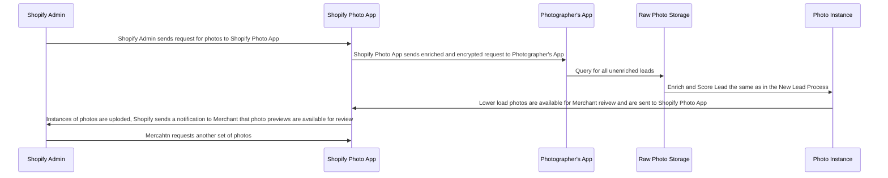

# Product Photography via Shopify
Product Requirements
- 

### Technical Requirements
- Handle large photo files, still be fast
- Direct authenticated uploads to AWS and Google storage, to tokenize photos (cloud storage that is meant for this) 
- Resize images on the fly for the thumbnails

### Questions
- Is there a limit to how many requests a Merchant can make?
- Who are our parties, what are their responsibilities? 
- How many requests can a merchant make after rejection?
- Can they request a new photographer?
- How do we protect the photographer’s and the merchant’s info? What do we consider PII? Since the merchant is choosing to have this service done, what do we need to explicitly handle?
- Does the merchant get to choose a photographer? Let’s assume not
- How long do we store the various types of image files? For rejects, for thumbnails, for approved images? What do we need to keep, for how long, and any distinguishable chunks we could break down?
- How long do we leave the approval request open? 
- How do we access the resources?
- How many merchants is this being released to?
- How any photographers do we need to account for? Is there only one studio for this?
- How often are photos being passed between the camera and the storage?
- Where do we have to monitor states? Do we need background jobs or maintenance tasks?

