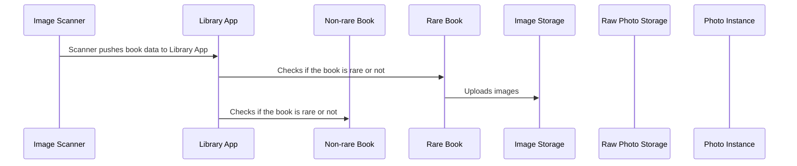

# Rare Books Prompt
### Product Requirements
- 

### Technical Requirements
- 

### Questions
- How many locations?
- Do we care about how many times a person has taken a book?
- Do we have a damage scale?

